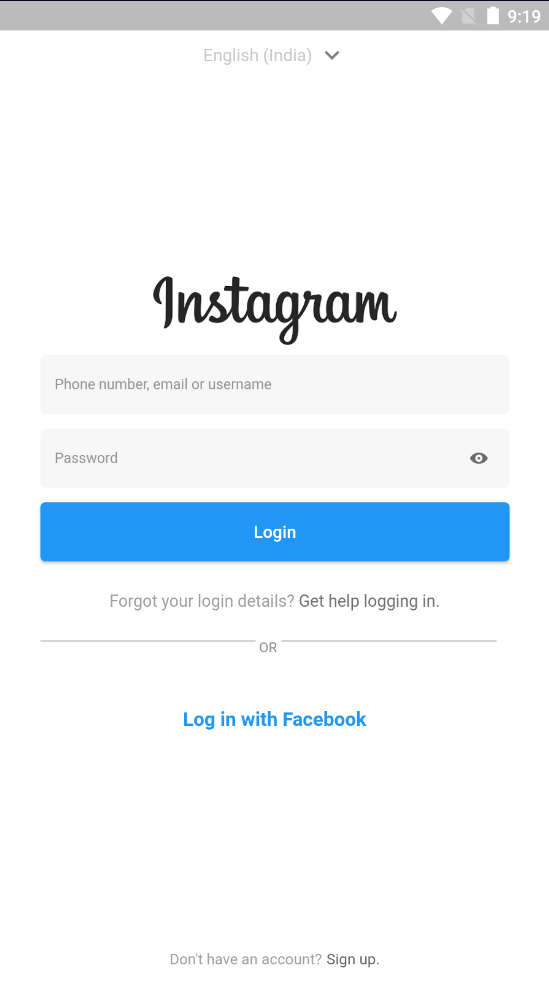

# Flutter_insta_clone
This repository include Flutter insta clone explainig working of 3 main widgets. Pageview,Listview and listview builder.
To use this code copy all files in VS Code or Android Studio having Flutter extension already installed.

